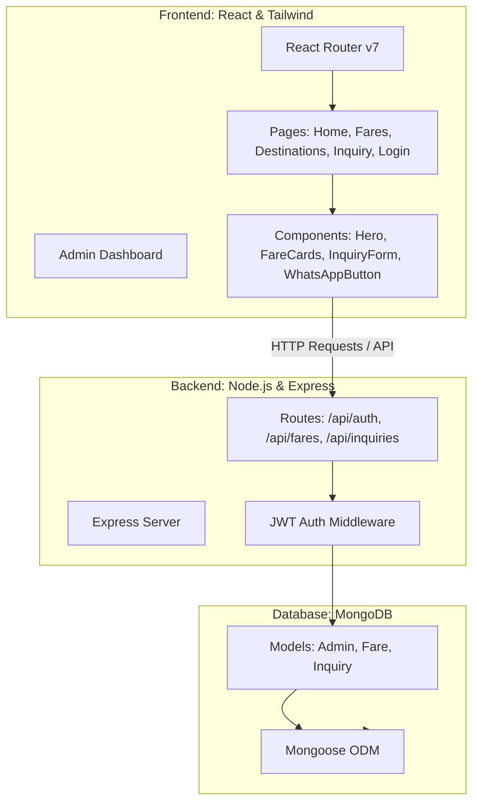

# Codebase Analysis: Chamakkala Travels Web Application

An in-depth study of the technical architecture, database schemas, API flows, and UI/UX implementation of the **Chamakkala Travels** website.

---

## 1. Business Context

**Chamakkala Travels** (or *Chamakala Travels*) is a localized travel agency based in **Neendoor, Kottayam, Kerala, India** (specifically located on the Ettumanoor - Neendoor Road). Established in 2019, the agency offers bespoke flight and railway ticketing, custom travel packages, and specialized heritage/cultural itineraries. The website serves two primary purposes:
1. **Customer-Facing Portal:** Allowing visitors to browse live travel fares, explore popular destinations, and submit detailed, custom travel inquiries.
2. **Admin-Facing Portal:** Allowing agents to log in securely, view and update customer inquiries (managing the sales pipeline), and publish new live fares directly to the website homepage.

---

## 2. Architecture & Tech Stack

The application is structured as a modern **MERN (MongoDB, Express, React, Node.js)** full-stack application split into separate `client` and `server` directories.



### Tech Stack Details
* **Frontend:**
  * **React 19** & **Vite 8** (high-performance bundler)
  * **Tailwind CSS v4** (utility-first styling with modern custom configurations)
  * **Framer Motion 12** (smooth micro-animations and entrance transitions)
  * **Lucide React** (modern iconography)
  * **React Router Dom v7** (client-side routing)
* **Backend:**
  * **Node.js** & **Express 5** (fast, unopinionated routing framework)
  * **MongoDB** with **Mongoose 9** (Object Data Modeling)
  * **JSON Web Tokens (JWT)** & **BcryptJS 3** (secure password hashing & authentication)
  * **Cors** & **Dotenv** (configuration & cross-origin request handling)

---

## 3. Database Schema (Mongoose Models)

The backend utilizes three primary collections defined under `server/models/`:

### A. Admin Model (`server/models/Admin.js`)
Stores administrator credentials for the dashboard.
* **email** (`String`, required, unique): The login identifier (e.g., `admin@chamakala.com`).
* **password** (`String`, required): Hashed password.
* **Pre-save Hook:** Uses `bcrypt` to automatically hash the password with 10 salt rounds before persistence.
* **Method (`matchPassword`):** Reusable method to compare entered plain-text passwords with the stored hash during authentication.

### B. Fare Model (`server/models/Fare.js`)
Represents promotional transport fares displayed to visitors.
* **type** (`String`, required): Enum restricting to `['Flight', 'Train', 'Bus']`.
* **from_location** (`String`, required): Departure point.
* **to_location** (`String`, required): Destination point.
* **price** (`Number`, required): Cost in Indian Rupees (₹).
* **travel_date** (`Date`, required): Date of travel.
* **provider** (`String`, default: `'Chamakala Travels'`): Agency or carrier details.
* **createdAt** (`Date`, default: `Date.now`): Timestamp for sorting.

### C. Inquiry Model (`server/models/Inquiry.js`)
Tracks customer trip inquiries submitted via the public form.
* **name** (`String`, required): Customer name.
* **phone** (`String`, required): Customer contact phone number.
* **destination** (`String`, required): Desired travel destination.
* **travel_type** (`String`, required): Enum supporting `['Flight', 'Train', 'Bus', 'Package', 'Other']`.
* **passenger_count** (`Number`, required, minimum `1`): Number of travelers.
* **budget** (`String`): Customer budget range (e.g. `₹50,000`).
* **notes** (`String`): Special requests or remarks.
* **status** (`String`, default: `'New'`): Enum tracking follow-up status `['New', 'In Progress', 'Completed']`.
* **createdAt** (`Date`, default: `Date.now`): Date and time of inquiry submission.

---

## 4. API Endpoint Reference

The Express server runs by default on port `5000` and registers the following routing structures:

| HTTP Method | Route | Authentication | Purpose |
| :--- | :--- | :--- | :--- |
| **GET** | `/api/health` | Public | Returns status 'ok' to verify backend health. |
| **POST** | `/api/auth/login` | Public | Authenticates admin credentials, generates a 30-day JWT. |
| **GET** | `/api/fares` | Public | Retrieves all live travel fares sorted by most recent. |
| **POST** | `/api/fares` | **Protected (JWT)** | Creates a new live fare promotion. |
| **POST** | `/api/inquiries` | Public | Customer submits a customized travel request. |
| **GET** | `/api/inquiries` | **Protected (JWT)** | Admin fetches all submitted customer inquiries. |
| **PUT** | `/api/inquiries/:id/status` | **Protected (JWT)** | Admin updates inquiry lifecycle status. |

---

## 5. UI/UX & Styling Language

The visual layer exhibits a premium, modern dark-themed aesthetics customized via `client/tailwind.config.js`:
* **Colors:**
  * Primary Background: `brand-dark` (`#030A18`), providing a premium midnight-blue foundation.
  * Card Accents: `brand-blue` (`#0B1B3D`), matching glassmorphic cards.
  * Golden Highlights: `brand-gold` (`#F59E0B`), drawing eyes to CTA buttons, prices, and branding.
  * Success Accents: `brand-green` (`#10B981`), applied to destinations and navigation accents.
* **Fonts:** Uses **Inter** as the default sans-serif font, styled dynamically with crisp high-contrast text.
* **Micro-Animations:** Driven by `framer-motion` to smoothly fade in components, float cards on hover (`hover:-translate-y-2`), and slide in elements securely.
* **Integrated Widget:** Includes a floating WhatsApp floating button linked to the agency’s official phone number (`094956 84965`) for instant communication.
* **Interactive Maps:** Implements an custom-styled interactive Google Maps iframe showcasing their physical Kottayam office location with a modern grayscale effect that transitions to color on hover.

---

## 6. Key Workflows

### A. Customer Travel Planning & Inquiry Flow
```
[Customer on Homepage] 
        │
        ▼
[Sees Hero/Latest Fares] ──── (Desires custom trip) ────► [Fills InquiryForm]
                                                                  │
                                                                  ▼
[Customer receives success state] ◄─── [Express saves to DB] ◄─── [POST /api/inquiries]
```

### B. Admin Management Lifecycle
```
[Accesses /login] ──► [Submits admin credentials] ──► [Stores JWT in localStorage]
                                                            │
                                                            ▼
[Updates inquiry status (New -> In Progress -> Done)] ◄─── [/admin Dashboard] ───► [Publishes New Fares]
```

---

## 7. Configuration Details & Local Startup

### Running the Project
* **Seed Admin User:**
  To seed the initial admin database user (`admin@chamakala.com` with password `admin123`), run:
  ```powershell
  cd server
  npm run dev (or run node scripts/seedAdmin.js directly)
  ```
* **Development Servers:**
  * **Backend:** Runs in `server` via `npm run dev` (starts Express + MongoDB connection).
  * **Frontend:** Runs in `client` via `npm run dev` (spins up the Vite preview server).
